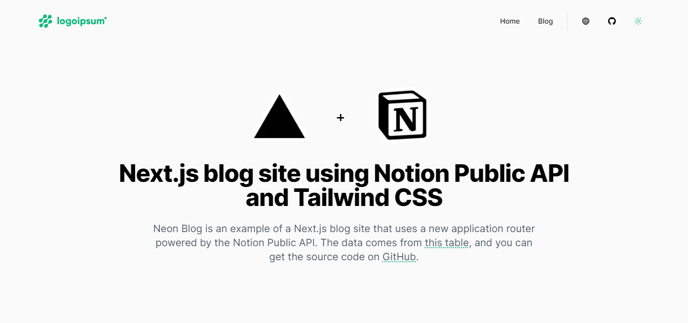

# Neon Blog

This is an example of a Next.js site that uses the new [Next.js file system router](https://nextjs.org/docs/routing/introduction) to create a blog site that is powered by the [Notion Public API](https://developers.notion.com/).

Live example hosted on Vercel: https://neonblog.vercel.app/



## ⚙️ Create Your Page Table

To get started, you need to follow these steps:

1. Create a new blank Notion page

2. Add inline table on your page

3. Add the below fields to your table

   - `title`: This is the title of your blog post
   - `slug`: This is the slug of your blog post,it should be a text property
   - `author`: This is the author of your blog post, it should be a person property
   - `banner`: This is the banner of your blog post, it should be a file property
   - `bannerImageHeight`: This is the height of your banner image, it should be a number property
   - `bannerImageWidth`: This is the width of your banner image, it should be a number property
   - `created_at`: This is the created date of your blog post, it should be a date property
   - `excerpt`: This is the excerpt of your blog post, it should be a text property
   - `highlight`: This is checkbox to highlight your blog post, it should be a checkbox property
   - `status`: This is the status of your blog post, it should be a status property with options: `draft` and `published`
   - `tags`: This is the tags of your blog post, it should be a multi-select property
   - `updated_at`: This is the updated date of your blog post, it should be a date property

## 🔑 Getting Blog ID & Token

To get your Notion Blog ID and Token, you need to follow [Notion's Getting Started Guide](https://developers.notion.com/docs/getting-started). Then, you need to add your `NOTION_SECRET` and `NOTION_DATABASE_ID` to your `.env.local` file.

## 📝 Creating Blog Posts

1. Create a new row in your database in Notion
2. Add a title, banner, bannerImageHeight, bannerImageWidth, tags, and content
3. Fill slug with the same value as the title, but in lowercase and with dashes instead of spaces
4. Fill excerpt with a short description of the post
5. Fill checkbox highlight with true if you want to highlight the post
6. Fill status with published if you want to publish the post
7. Repeat!

## 🖥️ Running Locally

1. Clone this repo

   ```bash
   git clone https://github.com/Ikram-Maulana/neon-blog.git
   ```

2. Install dependencies

   ```bash
   pnpm install
   ```

3. Add your `NOTION_SECRET` and `NOTION_DATABASE_ID` to your `.env.local` file

   ```bash
    NOTION_SECRET=...
    NOTION_DATABASE_ID=...
   ```

4. Run the development server

   ```bash
   pnpm dev
   ```

5. Open [http://localhost:3000](http://localhost:3000) with your browser to see the result.

## ✅ To Do Next

- [ ] Add Search Functionality
- [ ] Add Query Posts by Tag
- [ ] Add Query Posts by User

## 🚀 Deploy Your Own

1. Clone this repo

   ```bash
   git clone https://github.com/Ikram-Maulana/neon-blog.git
   ```

2. Configure project with [Vercel](https://vercel.com)

3. Add your `NOTION_SECRET` and `NOTION_DATABASE_ID` to your [Vercel Project Environment Variables](https://vercel.com/docs/environment-variables)

4. Do final deploy with Vercel
